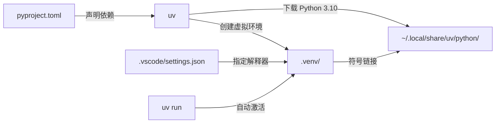
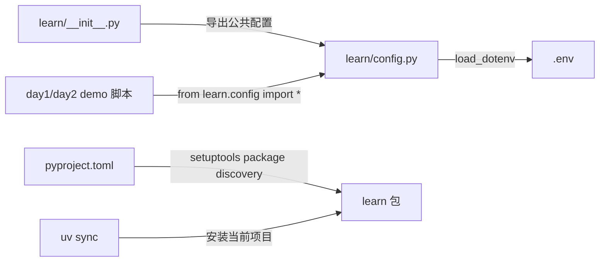

# lm-ai-future

AI 学习项目，涵盖 API 调用、SDK 使用、Embedding、Vision、Function Calling 等实践。

## 环境

- Python >= 3.10（uv 管理）
- 依赖见 `pyproject.toml`

### uv 工作流



| 层 | 说明 |
|----|------|
| `uv` | Python 包管理器（替代 pip + venv），负责下载 Python 本体 + 创建 `.venv` + 安装依赖 |
| `pyproject.toml` | 声明项目依赖和本地包发现规则，`uv sync` 会把 `learn` 安装为可导入包 |
| `.python-version` | 声明项目需要 Python 3.10，uv 自动识别 |
| `.venv/bin/python` | 符号链接 → uv 管理的 CPython 3.10 |
| `uv.lock` | 锁定精确依赖版本 |
| `.vscode/settings.json` | 告诉 VS Code 使用 `.venv/bin/python` 运行/调试代码 |

## 项目架构

项目采用“学习脚本 + 公共配置包”的结构：



- `learn/config.py`：统一加载 `.env`，业务脚本不再各自调用 `load_dotenv()`。
- `learn/__init__.py`：声明 `learn` 为项目包入口。
- `pyproject.toml`：通过 `[tool.setuptools.packages.find]` 把 `learn` 注册为本地包。
- `uv sync`：同步依赖时会安装当前项目，因此使用绝对路径运行 demo 也能导入 `learn.config`。

## 快速开始

```bash
uv sync
cp .env.example .env
uv run python learn/day1-demo/req_call.py
```

也可以直接使用虚拟环境解释器运行：

```bash
.venv/bin/python learn/day1-demo/req_call.py
```

如果使用绝对路径运行脚本，请先确保已经执行过 `uv sync`：

```bash
/Users/zm/lm/lm-ai-future/.venv/bin/python /Users/zm/lm/lm-ai-future/learn/day1-demo/req_call.py
```

如果 VS Code 仍提示导入错误，请手动选择工作区解释器：`.venv/bin/python`。

## 目录

| 文件/目录 | 作用 |
|-----------|------|
| `.env.example` | 环境变量模板，复制为 `.env` 后填入 `OPENAI_API_KEY` |
| `.gitignore` | Git 忽略规则，排除 `node_modules`、`.venv`、`__pycache__`、日志、构建产物等 |
| `.gitmodules` | Git 子模块配置，将 `front/skills` 目录链接到外部仓库 `lm-skill` |
| `.python-version` | 指定项目使用的 Python 版本为 3.10（uv/pyenv 自动识别） |
| `LICENSE` | MIT 开源许可证 |
| `README.md` | 项目说明文档，介绍项目用途、环境和快速开始命令 |
| `pyproject.toml` | Python 项目元数据和依赖声明（`python-dotenv`、`requests`），要求 Python >= 3.10 |
| `uv.lock` | uv 包管理器的依赖锁定文件，记录精确的依赖版本和哈希值 |
| `learn/` | 学习示例代码与公共配置包（day1-demo / day2-demo / config.py） |
| `front/` | 前端相关（agent / demo / mcp / rules） |
| `config/` | 配置文件（API、编辑器 MCP 等） |
| `.vscode/` | VS Code 工作区配置（Python 解释器路径） |
| `.venv/` | 虚拟环境目录（已忽略提交） |

## 环境变量

```bash
cp .env.example .env
```

然后在 `.env` 中设置：

- `OPENAI_BASE_URL`：默认 `https://api.openai.com/v1`
- `OPENAI_API_KEY`：你的 API Key
- `DEEPSEEK_BASE_URL`：DeepSeek 兼容 OpenAI SDK 的接口地址
- `DEEPSEEK_API_KEY`：DeepSeek API Key
- `GLM_BASE_URL`：GLM 兼容 OpenAI SDK 的接口地址
- `GLM_API_KEY`：GLM API Key

```
learn/
├── __init__.py    # learn 包入口
├── config.py      # 统一加载 .env
├── day1-demo/    # API 基础调用
└── day2-demo/    # SDK、Embedding、Vision 等进阶
front/            # 前端相关
config/           # 配置文件
```
