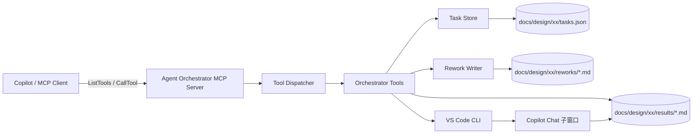
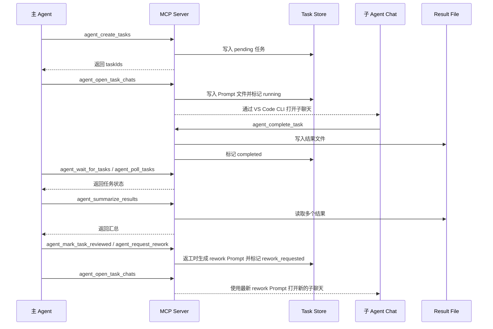

# Agent Orchestrator MCP

Agent Orchestrator MCP 是一个基于 Model Context Protocol（MCP）的 Agent 编排服务，用于在 VS Code / Copilot Chat 场景下拆分、分发、跟踪和汇总多 Agent 子任务。

## 背景

在复杂研发任务中，主 Agent 经常需要把工作拆分给多个独立子 Agent，例如：

- 并行阅读不同模块代码；
- 分别完成不同文件或功能点的实现；
- 独立输出调研、评审、测试或修复结果；
- 由主 Agent 统一校验、汇总并推进后续流程。

纯对话方式缺少稳定的任务状态、结果文件和完成协议，容易出现以下问题：

- 子任务边界不清晰；
- 任务状态依赖人工记忆；
- 子 Agent 结果难以统一收集；
- 主 Agent 无法可靠判断哪些任务已完成、失败或需要返工。

本项目通过 MCP 工具提供一套轻量级本地任务编排能力：主 Agent 创建任务，服务端在工作区内维护任务记录和结果路径，子 Agent 根据生成的任务 Prompt 执行，完成后写入结果并更新状态，主 Agent 再读取、审查和汇总结果。

## 架构

### 整体结构



### 模块划分

| 模块 | 路径 | 职责 |
| ---- | ---- | ---- |
| 入口 | `src/index.ts` | 创建 stdio MCP 传输，注册工具列表和工具调用处理器。 |
| Server 聚合 | `src/server/index.ts` | 汇总所有功能工具，并把 MCP 请求转发到对应 dispatcher。 |
| Orchestrator | `src/server/feature/orchestrator/` | 提供任务创建、打开子聊天、轮询、等待、完成、读取、审查、返工和汇总等工具。 |
| Task Store | `src/server/base/task-store/` | 维护任务记录，生成默认 Prompt / Result 路径，读写任务状态。 |
| Path Guard | `src/server/base/task-store/path-guard.ts` | 校验 `workspaceRoot` 必须是绝对路径，并限制输入 / 输出文件位于工作区内。 |
| 工具参数 | `src/utils/args.ts` | 解析和校验 MCP 工具入参。 |
| 响应格式 | `src/utils/text.ts` | 把工具返回值统一包装为 MCP text content。 |

### 数据落盘

所有任务数据默认写入调用方传入的 `workspaceRoot` 内。若能从 `inputFiles` 或 `resultFile` 推断出需求目录，则直接落在 `docs/design/xx/` 或 `docs/prod/xx/` 下；无法推断时使用 `docs/` 兜底：

```text
<workspaceRoot>/
	docs/
		design/
			xx/
				tasks.json              # 任务列表和状态记录
					reworks/
						task-<uuid>-rework-1.md # 返工要求文档
				results/
					task-<uuid>.md          # 子 Agent 结果文件
```

### 任务状态

| 状态 | 含义 |
| ---- | ---- |
| `pending` | 任务已创建，尚未打开子聊天或开始执行。 |
| `running` | 已通过 VS Code CLI 打开子聊天窗口，等待子 Agent 完成。 |
| `completed` | 子 Agent 已写入结果，或轮询时检测到结果文件已存在。 |
| `failed` | 任务失败。 |
| `reviewed` | 主 Agent 已审查该任务结果。 |
| `rework_requested` | 主 Agent 要求子任务返工。 |

任务记录中还会保存 `inputFiles`、`resultFile`、`reviewNote`、`reworkCount` 等字段。返工记录使用独立的 `prompt` 作为子任务说明，并通过 `rework.inputFiles` 挂载返工要求文档。

### MCP 工具

| 工具 | 说明 |
| ---- | ---- |
| `agent_create_task` | 创建单个编排任务。 |
| `agent_create_tasks` | 批量创建多个编排任务。 |
| `agent_list_tasks` | 列出指定工作区任务，可按状态过滤。 |
| `agent_get_task` | 获取单个任务详情。 |
| `agent_open_task_chats` | 为任务生成 Prompt 文件，并通过 VS Code CLI 打开 Copilot Chat 子窗口。 |
| `agent_wait_for_tasks` | 等待多个任务完成，基于状态和结果文件轮询。 |
| `agent_poll_tasks` | 非阻塞查看多个任务的当前状态。 |
| `agent_complete_task` | 子 Agent 写入结果并标记任务完成。 |
| `agent_read_task_result` | 读取已完成任务的结果文件。 |
| `agent_mark_task_reviewed` | 主 Agent 审查通过后标记任务为已审查。 |
| `agent_request_rework` | 主 Agent 发现结果不合格时标记返工。 |
| `agent_summarize_results` | 读取多个任务结果并生成汇总文本。 |

## 工作流

### 1. 主 Agent 拆分任务

主 Agent 根据当前需求识别可以独立执行的子任务，并调用 `agent_create_task` 或 `agent_create_tasks` 创建任务。每个任务包含：

- `title`：任务标题；
- `prompt`：任务说明和验收要求；
- `workspaceRoot`：任务所属工作区绝对路径；
- `inputFiles`：子任务需要读取的文件列表；
- `resultFile`：可选结果文件路径，未传时默认写入 `docs/design|prod/<需求目录>/results/task-<uuid>.md`，无法推断需求目录时写入 `docs/results/task-<uuid>.md`。

创建后，服务端会在同一需求目录下的 `tasks.json` 中追加任务记录，初始状态为 `pending`。

### 2. 打开子聊天窗口

主 Agent 调用 `agent_open_task_chats` 后，服务端会：

1. 合并任务的 `inputFiles` 与当前返工的 `rework.inputFiles`；
2. 通过 VS Code CLI 为每个输入文件追加 `--add-file <inputFile>`；
3. 将任务状态更新为 `running`；
4. 返回任务 ID 和结果文件路径。

子聊天窗口中的 Agent 读取已挂载输入文件，并按照任务的独立 `prompt` 完成执行和结果写入。

### 3. 子 Agent 执行并提交结果

子 Agent 完成任务后有两种完成方式：

- 推荐：调用 `agent_complete_task`，由服务端写入结果文件并更新状态为 `completed`；
- 兼容：直接写入任务的 `resultFile`，主 Agent 后续轮询时会检测结果文件并自动同步为 `completed`。

子 Agent 不应提交代码、推送代码、删除文件或执行破坏性操作。

### 4. 主 Agent 等待或轮询状态

主 Agent 可以根据场景选择：

- `agent_wait_for_tasks`：阻塞等待多个任务完成，适合需要统一收口的任务；
- `agent_poll_tasks`：非阻塞查看当前进度，适合在等待过程中展示任务状态。

轮询结果会返回总数、已完成数、失败数、待处理数，以及每个任务的状态、结果文件路径和更新时间。

### 5. 读取、审查和汇总结果

任务完成后，主 Agent 可以：

1. 使用 `agent_read_task_result` 读取单个任务结果；
2. 使用 `agent_summarize_results` 合并多个任务结果；
3. 审查通过后调用 `agent_mark_task_reviewed`；
4. 结果不合格时调用 `agent_request_rework`，写入返工原因并生成返工要求文档。

### 6. 返工流程

当主 Agent 校验发现子任务结果不合格时，调用 `agent_request_rework`：

```json
{
	"workspaceRoot": "/absolute/workspace",
	"taskId": "task-<uuid>",
	"reason": "缺少边界场景分析，请补充后覆盖结果文件。"
}
```

服务端会：

1. 将任务状态更新为 `rework_requested`；
2. 将 `reviewNote` 写为返工原因；
3. 将 `reworkCount` 加 1；
4. 生成同一需求目录下的 `reworks/task-<uuid>-rework-N.md`；
5. 将返工文档写入 `rework.inputFiles`，并生成一条简短独立的 `rework.prompt`。

随后主 Agent 再调用 `agent_open_task_chats`，服务端会同时挂载原任务输入文件与当前 `rework.inputFiles`，并把 `rework.prompt` 作为子任务指令。子 Agent 按返工文档修订并覆盖写回同一个 `resultFile`，完成后调用 `agent_complete_task`。

推荐主窗口口令：

```text
请返工 task-<uuid>，原因是：缺少边界场景分析，请补充后覆盖结果文件，并打开子聊天窗继续执行。
```

### 7. 典型时序



## 使用方式

### 安装依赖

```bash
pnpm install
```

### 构建

```bash
pnpm run build
```

### 启动

```bash
pnpm run start
```

开发时可使用：

```bash
pnpm run start:watch
```

### 配置说明

服务通过 stdio 暴露 MCP 能力，入口为构建后的 `dist/index.js`，也可以通过包命令 `agent-orchestrator-mcp` 启动。

如果环境中默认 `code` 命令不可用，可以通过 `CODE_CLI` 指定 VS Code CLI 路径：

```bash
CODE_CLI="/Applications/Visual Studio Code.app/Contents/Resources/app/bin/code" pnpm run start
```

## 安全边界

- `workspaceRoot` 必须是绝对路径；
- `inputFiles` 和自定义 `resultFile` 必须位于 `workspaceRoot` 内；
- 服务只负责工作区内任务记录、Prompt 文件和结果文件读写，默认位置为 `docs/design|prod/<需求目录>/`；
- 子 Agent Prompt 明确禁止提交、推送、删除文件或执行破坏性操作；
- `agent_open_task_chats` 只打开子聊天窗口，不读取聊天输出。

## 开发命令

| 命令 | 说明 |
| ---- | ---- |
| `pnpm run build` | TypeScript 编译。 |
| `pnpm run dev` | 先构建再启动 MCP 服务。 |
| `pnpm run start` | 启动已构建产物。 |
| `pnpm run start:watch` | 监听 `src` 变更并重新构建启动。 |
| `pnpm run lint` | 执行 ESLint。 |
| `pnpm run test` | 执行 Node.js 测试。 |
